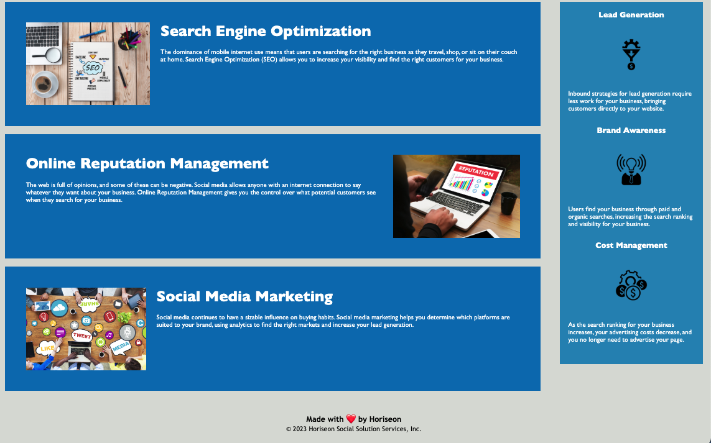

# Horiseon-website

## Description
This project was built to show the potential customers the benefits of using Horiseon, a company created to provide solution services to social media related issues.

## Screenshots

## Link
https://irimeroi.github.io/horiseon-website/#social-media-marketing

## Installation
N/A

## Usage
In order to use this website, one simply needs to access it by clicking in the link found in the horison-website repository, and move around by either using output or input devices. Accessibility issues were contemplated when creating the code, which is why the website could be accessed and comprehended by any kind of device. 

## Credits
The starter code for this website was originated by the Bootcamp Spot at the UCLA Extension Web Development course.

## License
This project uses MIT license. Please refer to the repository for more information.

